# chromonic

**Experimental.** Chromonic is a standalone project proving that Domonic can
be the DOM/CSSOM behind a native rendering pipeline:

```
domonic DOM + CSSOM  ->  Taffy (Rust, via PyO3)  ->  layout  ->  written back
                                                                  onto the DOM
                                                                       |
                                                                       v
                                                              Skia (skia-python)
                                                                    paints it
```

See [`PLAN.md`](PLAN.md) for the full design and what's deliberately out of
scope. Short version: domonic owns the DOM and does the CSS cascade (via its
own `domonic.layout` module, added in 1.8.0); a small Rust extension binds
Taffy for flexbox/grid/block layout; Skia paints from the geometry Taffy
computed, written straight back onto the same domonic elements
(`element.set_layout_box(...)`) so `element.getBoundingClientRect()` tells
the truth about what got painted.

## Build & run

```bash
cd chromonic
make venv
make develop                         # compiles the Rust extension and installs chromonic editable
.venv/bin/python examples/poc.py     # -> examples/poc.png, examples/poc_mutated.png
make test
```

Needs a Rust toolchain (`cargo`/`rustc`) on `PATH`; `skia-python` installs
from a prebuilt wheel (no C++ build needed on macOS/Linux/Windows x86_64 or
macOS arm64).

## Domonic Canvas 2D replay

```bash
.venv/bin/python examples/hello_canvas.py
```

`hello_canvas.py` creates a normal Domonic `<canvas>`, draws through its
existing `CanvasRenderingContext2D`, and writes `examples/hello_canvas.png`
through Chromonic's Skia painter. Call `chromonic.initialize()` before page
code records commands. The native browser does this automatically before its
loader runs.

Domonic's current recorder does not retain historical drawing state, so
Chromonic temporarily installs a reversible compatibility hook. Each command
contains an immutable state and `Path2D` snapshot; `canvas2d.py` consumes only
that data. Solid colours, rectangles, paths, transforms, line styles and text
are supported. Gradients, patterns, clipping, images and pixel buffers raise a
clear `NotImplementedError` until their replay implementations land.

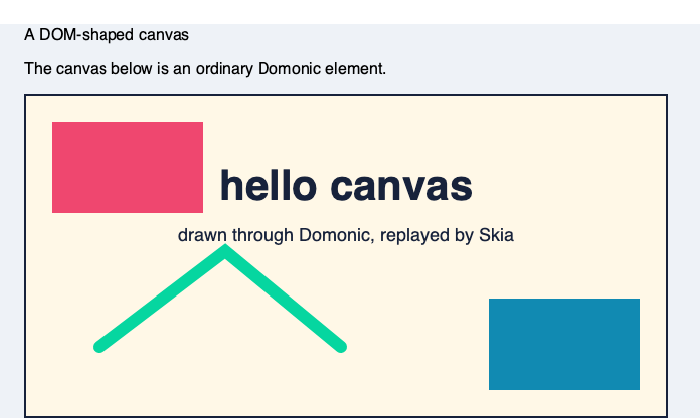

## What the POC proves

`examples/poc.py` builds one domonic page — nested elements, text, margins/
padding, a flex row, a CSS grid (including a spanning cell), backgrounds,
borders, and a button — lays it out through Taffy, and paints it through
Skia:

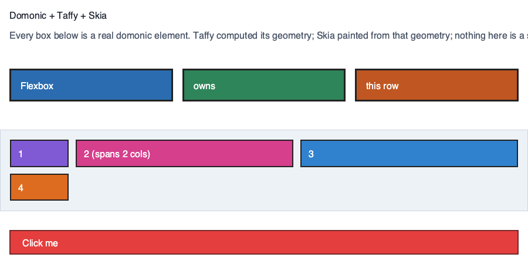

It then asserts `element.getBoundingClientRect()` equals the exact
`LayoutBox` chromonic painted from, for the root and several children (not a
visual eyeball check — a real equality assertion), and demonstrates the live
mutation loop from the brief:

```python
grid.style.width = "400px"
chromonic.tree.layout(root, width=900)   # mark dirty -> rerun Taffy -> new geometry
chromonic.paint.render_png(root, ...)    # -> repaint
```

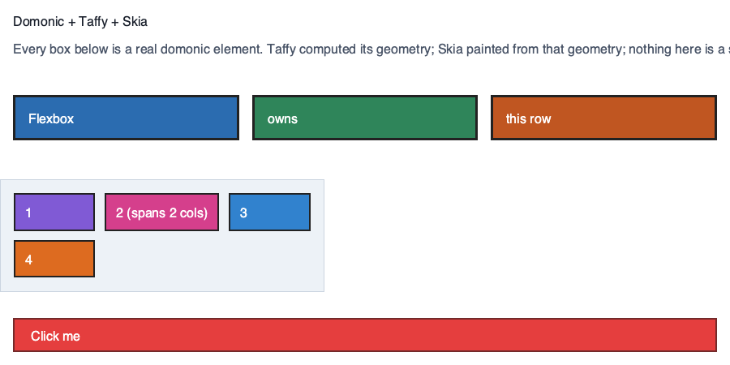 — the grid's three tracks
re-flow into the narrower box; everything else is untouched, because the
POC's layout call recomputes the whole tree (see "Invalidation" in
PLAN.md) but nothing else's style changed.

Hit-testing also works: a coordinate resolves back to the innermost domonic
element under it (`chromonic.hittest.hit_test`).

## Phase 2 — a real, interactive window

```bash
.venv/bin/pip install -e '.[window]'        # adds pywebview
.venv/bin/python examples/live.py           # opens a real window -- click the button
```

Click the button and its background colour changes, and a counter above it
updates — from an ordinary `addEventListener("click", ...)` on a real
domonic element. `pywebview` hosts the window strictly as a plain `` +
a click-coordinate bridge; it never sees the domonic tree and never renders
any of it. Skia paints every frame, exactly as in the static PNGs above.
See "Phase 2" in [`PLAN.md`](PLAN.md) for the click -> hit-test -> real DOM
event -> relayout -> repaint loop, and why `pywebview` (already proven
elsewhere in this repo) rather than a new native-window dependency.

## Phase 3 — a continuous animation

```bash
.venv/bin/python examples/animate.py       # a live bar equalizer, ~30fps
```

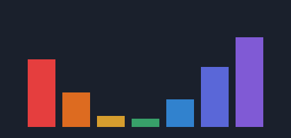 (one frame — it's a live animation;
run it to see it move) — seven bars, each height an independent
phase-shifted sine wave, driven entirely by Python mutating
`element.style.height` and chromonic relaying that through a real Taffy
relayout and a real Skia repaint on every tick. No new machinery: the clock
is a `setInterval` in the hosted page calling the same bridge a click
already uses, just on a timer — "animation" is click-handling with the
clock as the event source, not a separate code path. See "Phase 3" in
[`PLAN.md`](PLAN.md).

## Phase 4 — a simple, navigable browser

```bash
.venv/bin/pip install -e '.[browse]'        # adds pywebview + myjs
.venv/bin/python examples/browse.py [url]   # defaults to https://example.com/
```

A real address bar, real navigation (click any `<a href>`, or type a URL and
hit Enter/Go), and a back button — built to make it easy to *look* at how
domonic's DOM/CSSOM/layout renders a real, live page, next to a real browser
showing the same URL. `myjs.Page.load(url, run=False)` does the fetching:
external stylesheets are fetched and folded in, `<script>`s never run (chromonic
only cares about the DOM/CSSOM they'd otherwise mutate, not their behaviour).
See "Phase 4" in [`PLAN.md`](PLAN.md) for the two prerequisite fixes real
pages needed (`<head>`/`<script>`/`<style>` and `display:none` elements have
to be skipped by the DOM walker, which demo-only pages never exercised) and
what's deliberately kept simple (fixed-size viewport, one-entry-deep back
history, no tabs — a visual-testing tool, not a general browser).

`https://example.com/`, rendered by chromonic (no browser involved — this is
`myjs`'s fetch, domonic's cascade, Taffy's layout, and Skia's paint, same
pipeline as every PNG above):

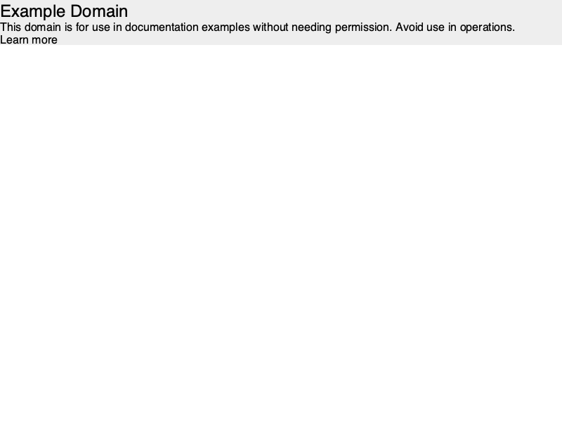

(the full-width grey band instead of a narrow, centered box is
`example.com`'s own CSS using `width: 60vw; margin: 15vh auto` —
`domonic.layout` doesn't resolve viewport-relative (`vw`/`vh`) units to a
`Length`, so they arrive at `style_bridge.py` as an unresolved `Keyword`,
which falls back to `"auto"` — a real narrow spot, not a chromonic one, but one
this browser feature was the first thing in this repo to actually notice.)

## A real wrinkle this surfaced

`Element.getBBox()` turned out to be **SVG-only** — domonic zeroes it for
any non-SVG element (see `dom.py`'s `getBBox`), so it can't measure plain
HTML text at all, despite `domonic.layout`'s own docstring listing
"text/intrinsic measurement" as one of the things domonic supplies to a
layout engine. The real engine exists (`domonic._fontmetrics.text_extent`,
the same font-metrics table SVG `<text>` uses) and works well — `tree.py`
uses it directly — but it isn't a public, HTML-facing API yet (no
`Element.measureText()`-equivalent). Worth an upstream fix: either make
`getBBox()` fall back to `_fontmetrics` for ordinary elements, or expose
`_fontmetrics.text_extent` (or an `Element`-level wrapper over it) publicly.

## Phase 5 — executable Python inside HTML

```html
<script type="text/python">
button = document.querySelector("#hello")

def clicked(event):
    button.textContent = "Clicked"

button.addEventListener("click", clicked)
</script>
```

```bash
.venv/bin/python examples/pyscript_demo.py        # the inline form above
.venv/bin/python examples/pyscript_src_demo.py    # the src="app.py" form
```

Before the click, and after (real content *and* style mutation, from Python,
redrawn through the ordinary Taffy relayout + Skia repaint every other click
in this repo already goes through):


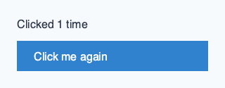

The headline finding: **nothing in `window.py`, `tree.py`, or `paint.py`
changed for this.** `Interaction.handle_click` already hit-tests, dispatches
a real `MouseEvent`, relayouts, and repaints on every click (phase 2) by
calling the element's own `dispatchEvent` — and domonic's event system has
never cared what *kind* of callable a registered listener is, only that it's
one. A function `exec()`'d out of a `<script type="text/python">` block
satisfies `addEventListener` exactly as well as any hand-written Python
closure in `examples/live.py` always has. Phase 5 is therefore almost
entirely `python/chromonic/pyscript.py`: find `<script type="text/python">`
tags (inline or `src=...`, this repo's own `myjs.Page.load(url, run=False)`
already leaves them completely unexecuted — it only runs JS and silently
skips types it doesn't know), and `exec()` their source with `document`/
`window` injected against the *same* live DOM the rest of chromonic is
rendering. See "Phase 5" in [`PLAN.md`](PLAN.md) for the full design,
including two small defensive checks borrowed from `perusal` (address-bar
leniency and refusing non-`http(s)` navigation/`src=`).

**No sandbox.** A `<script type="text/python">` page runs with the full
power of a normal Python `exec()` — no import allowlist, no resource limits.
Treat a `.py`-in-HTML page exactly like trusted application code you'd run
yourself (`python app.py`) — **never** point this at arbitrary, remote, or
user-supplied HTML/Python; there is no isolation here to protect against it.

## Phase 6 — absolute positioning + a particle performance demo

```bash
.venv/bin/pip install -e '.[window]'
.venv/bin/python examples/particles.py [initial_count]   # defaults to 200
```

A slider changes how many bouncing particles are on screen (0–10,000, live);
an FPS readout next to it shows the *measured* frame rate, not the rate the
demo asked for — a way to actually feel how chromonic's "recompute everything"
invalidation strategy (see "Known limitations" below) costs as the DOM
grows:

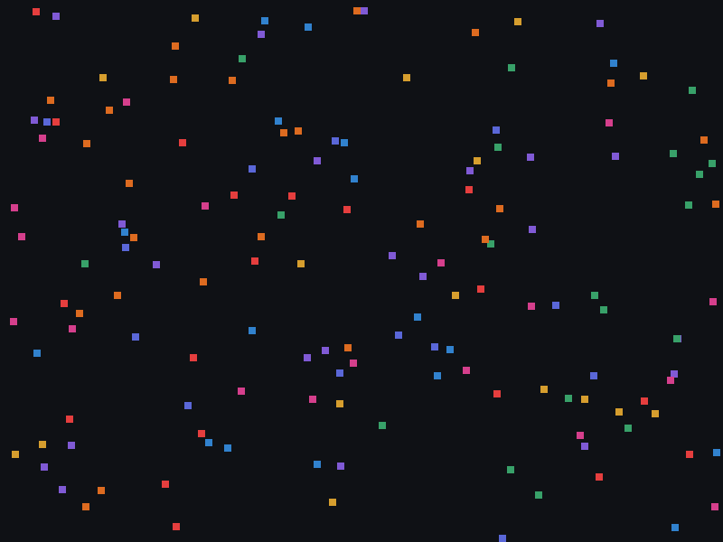

Headless numbers (no window, `ParticleInteraction.tick()` + `.render()`
timed directly — see "Phase 6" in [`PLAN.md`](PLAN.md)): roughly **38 fps at
50 particles, ~16 fps at 200, ~7 fps at 500, ~4 fps at 1000, ~2 fps at
2000** — after two real perf fixes profiling this demo turned up (below);
before them, every one of those numbers was roughly half. The remaining
cost is linear in total particle count because every tick still rebuilds the
*entire* Taffy tree from scratch, regardless of how many particles actually
moved — this demo is now a concrete benchmark for what a real incremental/
dirty-bit layout system (long-named future work here) would fix.

**Two profiling-driven fixes, not guesses.** `cProfile` on this demo showed
nearly all the time going into rebuilding CSS cascades, not into Taffy:
`tree.py` was constructing a `ComputedStyleDeclaration` per element **three
times over** each relayout (once to check `display`, once to build the
Taffy style dict, once again in `paint.py` for colours) purely because
`domonic.layout.layout_style()` has no way to accept one already built —
fixed by computing it once and sharing it (`docs/domonic-wrinkles.md` #13).
And the demo's own `element.style.left = ...; element.style.top = ...`
turned out to cost **~36x** what building the whole style string in Python
and setting it via one `element.setAttribute(...)` call does, since every
individual `style.<prop> = ` write round-trips through a full parse of the
*entire* inline style text (`docs/domonic-wrinkles.md` #14). Together: a
roughly 2x frame-rate improvement, entirely in `tree.py`/`paint.py`/
`examples/particles.py` — nothing about Taffy or Skia changed.

Getting free-moving particles working at all first needed one real feature
this POC didn't have yet: CSS `position: absolute` with `top`/`left`/etc.
(`inset`). Turned out to be a two-line fix once found — Taffy's `Style.inset` and
domonic's `LayoutStyle.inset` are already the exact same shape `margin` is
on both sides of the Rust↔Python boundary. See "Phase 6" in
[`PLAN.md`](PLAN.md) for the detail.

**A third bug, worse than slow: this demo could hang the whole window and
need force-quitting**, even after the two speed fixes above. The clock
driving every animated demo (`window.py`, since phase 3) fired
`window.pywebview.api.tick()` from a bare `setInterval` on a fixed timer —
which doesn't wait for one call to finish before the next is due. Once a
scene is slow enough that a tick takes longer than the requested interval
(a couple hundred particles gets there easily), calls queue up faster than
Python can drain them, an unbounded backlog that eventually makes the
window stop responding to anything, including its own close button. Fixed
by making the clock self-pacing — the hosted page now schedules each next
tick only once the current one's Promise resolves — so at most one `tick()`
is ever in flight and a slow scene just runs at whatever rate it can
actually sustain. The fix lives in `window.py` itself, so it also covers
`examples/animate.py`, which had the same latent bug and simply never had a
scene heavy enough to trip it.

## A second wrinkle, found building the browser feature

domonic's cascade never gives `<head>`, `<title>`, `<script>`, `<style>`,
`<meta>`, `<link>`, `<noscript>`, or `<template>` a default `display:none` —
`ComputedStyleDeclaration` reports plain `inline` for all of them, same as
any unrecognised tag, because there's no UA stylesheet backing it. A real
browser hardcodes exactly this exclusion; chromonic's `tree.py` now does too
(a tag skip-list, plus honouring any explicit `display:none`), rather than
laying out and painting a `<script>` element's source text as a paragraph.
See `docs/domonic-wrinkles.md` #11.

## Known limitations (intentional, see PLAN.md)

- The Python-script feature (`chromonic.pyscript`) has **no sandbox**: a
  `<script type="text/python">` runs with a plain `exec()`'s full power. It
  is scoped to trusted application code, the same trust level as running
  `python app.py` yourself — see "Phase 5" above. There is also no module
  system (every script on a page shares one flat namespace, matching a real
  page's script-tag execution model, not a real Python import system).
- The browser feature (`chromonic.browser`) is deliberately simple: a
  fixed-size, non-resizable viewport (no scrolling), a one-entry-deep back
  history and no forward history, no tabs/reload, and whatever cookies/
  redirects/TLS handling `myjs`'s underlying fetch already does and no more.
  It's a visual-testing tool for domonic's own rendering, not a
  general-purpose browser.
- Text wraps (phase 9), but font-family/style only affects *paint*, not
  *measurement* -- `domonic._fontmetrics` has one fixed Helvetica-shaped
  advance-width table, so a monospace or serif paragraph can visibly run
  past the box it was measured (and wrapped) as Helvetica. A real per-font
  shaping/measurement engine would fix this properly; real project of its
  own, see "Phase 9" in PLAN.md.
- The style bridge (`style_bridge.py`) covers exactly what the examples
  need -- not the full `LayoutStyle` surface (no `aspect-ratio`,
  `box-sizing`, named grid lines/areas, or `repeat()`/`minmax()`/
  `fit-content()` tracks). Absolute positioning's `inset` *is* modelled, as
  of phase 6.
- Invalidation is "recompute everything" -- no dirty-bit incremental layout
  (phase 2's live window relayouts the whole tree on every click too; the
  particle demo below turns this from a stated limitation into a number you
  can watch drop as you drag its slider).
- The window is a single, un-resizable frame sized to one page; no
  scrolling, no multiple windows/tabs, no keyboard input.

## Browse performance profiling

The [performance audit and reproducible benchmark](benchmarks/README.md) break
loading, style/layout, rasterization, PNG encoding, and bridge preparation into
separate measurements. The event bridges now avoid a second full layout, and
layout shares ancestor style resolution within each pass. The audit records
before/after samples and the next architectural priorities; its headless
numbers exclude real window delivery and are not on-screen FPS measurements.

## Direct GPU browser (`browse2.py`)

```bash
# In the existing development environment:
.venv/bin/pip install glfw PyOpenGL
.venv/bin/python chromonic/examples/browse2.py https://example.com/
# Packaged installation: pip install 'chromonic[native]'
```

`browse2.py` uses a GLFW native window and a Skia OpenGL GPU surface. Skia
paints text, rectangles, borders, and the toolbar directly into the window's
framebuffer. It does **not** encode PNGs, send base64 images, use a webview,
or upload a Python-generated bitmap on each frame. Display hardware still
ultimately displays pixels; the removed step is image serialization and
transport between two rendering systems.

Taffy lays out the page at the current window width. Resizing triggers fresh
layout and updates the CSS viewport; framebuffer scaling handles high-DPI
screens separately from logical input/layout coordinates. The document can
grow beyond the viewport. Wheel/trackpad scrolling repaints without relayout;
link hit-testing accounts for the scroll offset and toolbar. Idle windows
wait for events rather than rendering continuously.

The toolbar has Back, an address field, and Go. Click the address field or
press Cmd/Ctrl+L to replace it; type or paste (Cmd/Ctrl+V), then Enter. Cmd/Ctrl+A
selects the address, Backspace deletes, and Escape restores the current URL.
Up/Down and Page Up/Page Down scroll when the address field is not focused.
Left/Right and Home/End move the caret; Delete removes the next character.
Long addresses scroll horizontally to keep the caret visible. IME composition
and mouse text selection are not implemented yet.

This changes presentation and viewport handling, not the supported HTML/CSS
language. It shares the existing experimental Taffy style bridge and Skia
painter, including phase 8's UA stylesheet and `` loading (see below) --
mixed inline text, text wrapping, form controls, and other unsupported
browser features do not become implemented merely by using a GPU.
Page scripts remain disabled. Fetching/parsing runs in background workers;
DOM installation, layout, and GPU painting stay on the window thread. Newer
navigation supersedes older results, and arrival of a page preserves an
address edit already in progress. Active network requests cannot be cancelled
immediately, so process shutdown can wait for their network timeout. OpenGL/GLFW requires a
working desktop display and GPU driver; there is no silent PNG fallback.

Validation commands:

```bash
.venv/bin/python -m pytest chromonic/tests
.venv/bin/python chromonic/benchmarks/smoke_native.py
.venv/bin/python chromonic/examples/browse2.py https://example.com/ --frames 2
```

The GPU smoke test creates a hidden native window, checks rendered pixels,
resizes, scrolls, and swaps buffers. Pixel readback is only for that test;
normal `browse2` presentation has no readback or image encoding.


### Where domonic is used

`myjs.Page` parses the fetched HTML into a **domonic Document and Elements**.
`tree.py` reads their **domonic ComputedStyleDeclaration / LayoutStyle**, gives
those values to Taffy, and stores its resulting **domonic LayoutBox** back on
each element. `paint.py` walks those same elements and uses their styles and
boxes to issue Skia drawing commands. Hit testing returns a domonic Element;
click handlers receive a domonic MouseEvent.

The address bar and Back/Go buttons are hand-drawn Skia controls, not domonic
HTML inputs. Their keyboard editing is implemented by chromonic. Neither GLFW
nor a hidden browser engine parses or lays out the page.

### Missing native extension

If `chromonic._native` was deleted, rebuild it from this repository root:

```sh
.venv/bin/maturin develop --release --offline
```

The compiled `.so` is needed to call Taffy. It is generated from `src/lib.rs`;
Python files alone cannot replace it. Omit `--offline` if Cargo dependencies
have not previously been downloaded. `browse2.py` reports this repair command
when the extension is absent; `--help` still works without loading it.

## Chrome layout conformance

The permanent numeric correctness harness runs the focused fixtures in
`tests/layout/fixtures` through both installed headless Chrome and chromonic:

```sh
make layout-conformance
```

It compares every `data-layout` element's `getBoundingClientRect()` geometry
with a 0.5 CSS-pixel tolerance and reports exact Chrome, chromonic, and delta
values. Each fixture also writes focused computed styles plus `chrome.png`,
`ours.png`, and an amplified `diff.png`. Geometry controls the exit status;
screenshots and style serialization remain diagnostic. See
[`tests/layout/README.md`](tests/layout/README.md) for fixture conventions,
individual commands, and the initial mismatch baseline.

Chromonic currently carries a temporary four-module Domonic 1.8.1 snapshot in
`python/chromonic/_vendor/domonic`. Its import bootstrap supplies the pending
DOM/style invalidation cache and layout used-value fixes before the remaining
installed Domonic package loads. The snapshot includes `dom.py`, `style.py`,
and their required `_cssom.py`/`layout.py` support modules; remove it once the
equivalent upstream release is the minimum dependency.

## Direct GPU particles (`particles2.py`)

```sh
.venv/bin/python chromonic/examples/particles2.py 200
```

Reuses `particles.py`'s actual domonic particles, style mutations and Taffy
layout, then paints directly to the native Skia GPU surface. Drag the slider
or use +/- to change count; Space pauses. The FPS label measures loop cadence
through buffer swaps, including vsync, rather than a requested timer rate.
Motion uses the original per-tick simulation; faster frame rates therefore
also advance that simulation faster. Resize rebuilds the stage at its new size.

A matched, seeded benchmark (15 samples after 3 warmups; 800×600 scene) gave:

| Particles | PNG + base64 path | Direct GPU path |
| --- | ---: | ---: |
| 50 | 20.32 ms | 1.04 ms |
| 200 | 38.37 ms | 2.16 ms |
| 500 | 72.76 ms | 4.37 ms |
| 1000 | 134.06 ms | 8.74 ms |

These are **frame-work timings, not displayed FPS**. Both paths include the
same simulation and one full layout. GPU work is synchronized with `glFinish`
in a hidden window; the old path excludes real webview transport/decode. The
GPU path also paints its small toolbar. Both use equal scene pixel dimensions;
the interactive GPU window can use more physical pixels on Retina displays.
`particles2` now retains its Taffy projection and sends all changed insets in
one native batch after updating the authoritative Domonic attributes. It then
computes geometry without CSS resolution or topology reconciliation and paints
through a retained display list. Compared with the previous direct figures,
the 1,000-particle frame fell from 110.78 ms to 8.74 ms (about **12.7×**).
Profiling 20 ticks at that size put the native inset update plus Taffy compute
below 0.4 ms per frame. A later shared paint pass cached CSS colour conversion,
retained leaf metadata, and direct layout-box reads; Domonic attribute mutation
and publishing immutable `LayoutBox` objects are now the main layout-side costs.

Reproduce with `.venv/bin/python chromonic/benchmarks/compare_particles.py`.
Raw samples: [particles-gpu.json](benchmarks/results/particles-gpu.json).

The direct slider now ranges to 10,000 particles. A 3,000-particle sample
measured 26.58 ms (about 38 frame-work iterations/s); 10,000 measured 107.93
ms. The upper range is intended for stress testing as well as smooth motion.

## Phase 8 — a UA stylesheet + real `` loading

```bash
.venv/bin/python chromonic/examples/ua_and_images_demo.py   # -> examples/ua_and_images.png
```

A heading, a paragraph, an indented list, and a real decoded image, fetched
through the actual `chromonic.browser.load()` pipeline both `browse.py` and
`browse2.py` share (a tiny local HTTP server stands in for the network so
this runs offline):

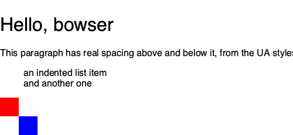

Two things changed to make this look like a page instead of a wall of
unstyled, unspaced, uniform-size text:

- **A UA stylesheet** (`python/chromonic/ua_style.py`) — domonic's cascade has
  none of its own (wrinkle #11), so `<h1>` looked exactly like `<p>` and
  `<ul>` never indented. Applied as a real CSS `@layer`, not a value
  heuristic or a plain "insert it first" trick — a heuristic can't tell "the
  author never mentioned this property" from "the author explicitly reset it
  to that value" (`* { margin: 0 }` is one of the most common rules on the
  real web), and plain source-order isn't enough either, since a real UA
  stylesheet loses to *any* author rule regardless of specificity, which
  `@layer` gives for free. **A second domonic cascade bug turned up along
  the way**, one `@layer` doesn't fix: a later `<style>`'s *shorthand*
  (`padding: 0`) loses to an *earlier* one's *longhand* (`padding-left:
  40px`) for the same property, regardless of order — so this stylesheet is
  written entirely in shorthands to route around it. Both findings are in
  `docs/domonic-wrinkles.md` (#15) and `PLAN.md` ("Phase 8").
- **Real image loading** (`python/chromonic/browser_images.py`) — fetches,
  decodes (`skia.Image.MakeFromEncoded`), and caches every ``
  (`data:` URIs too), resolved to an absolute URL against the page right
  after it loads. Getting its *size* right needed more than reusing the
  text-leaf measurement trick: Taffy stretches an ordinary block child to
  its container's width before ever asking for a measured size, which is
  correct for reflowing text but wrong for a "replaced element" like
  `` — the actual fix bakes the image's real pixel dimensions directly
  into its Taffy style (as if `width:64px` had been written in CSS) for
  whichever of `width`/`height` the page's own CSS left `auto`.

Known limitations of this pass: no `<picture>`/`srcset`/`object-fit`, no SVG
images (Skia's decoder just returns nothing for one), the HTML `width=`/
`height=` *attributes* on `` aren't honoured (only CSS sizes are), and
a page's first, never-cached image blocks its layout pass for one network
round-trip (fetches are synchronous, same as the rest of this POC). See
"Phase 8" in [`PLAN.md`](PLAN.md) for the detail.

## Phase 9 — text wrapping, fonts, and a real repaint perf fix

```bash
.venv/bin/python chromonic/examples/wrap_and_fonts_demo.py   # -> examples/wrap_and_fonts.png
```

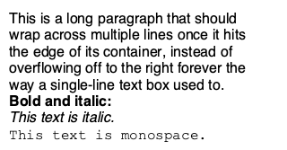

**Text actually wraps now.** A long paragraph reflows across as many lines
as its container needs, instead of overflowing off the right edge in one
line forever. `tree.py`'s text-leaf `measure` callback word-wraps to
whatever width Taffy gives it and stashes the exact lines for `paint.py` to
draw — verified: relaying the same paragraph out narrower produces more,
shorter lines, and re-widening it produces fewer, longer ones again.

**Fonts paint correctly now too** (`python/chromonic/fonts.py`) — bold,
italic, and `font-family` (including generic keywords like `monospace`/
`serif`, mapped to a concrete platform name) all resolve to a real
`skia.Typeface` and actually show up in the rendered pixels; previously
paint used one hardcoded system font for literally everything, regardless
of what a page's CSS said (bold *layout* already reserved the right amount
of space — see the equalizer/particles demos' bars for proof layout has
always known about bold widths — paint just never matched it). Honest
limit, unavoidable without a real font-shaping engine: measurement still
assumes one fixed Helvetica-shaped table regardless of `font-family` (see
"Known limitations" above), so a monospace/serif paragraph can paint in the
right font while still being sized as if it were Helvetica.

**Profiling `native_browser.py` found a real, unrelated perf bug worse than
slow for how it's actually used.** `paint` was taking *more* time than
`layout` on a ~50-element article page — backwards from every earlier
phase's profiling. Cause: `paint_element` read `ComputedStyleDeclaration`
attributes directly, and every single access re-resolves from the
underlying style text — nothing is cached on the object. That cost was
being paid on *every paint*, and `browse2.py`'s whole model is "relayout
only on resize, scroll/expose just repaint" — so **every scroll event was
re-resolving every element's colours and fonts from scratch for nothing.**
Fixed by extracting exactly what paint needs once per element per *layout*
(`tree.py`'s `_extract_paint_style`) instead of once per *paint*. Measured:
a repeated repaint with no relayout between them dropped from **~22ms to
~2.9ms — roughly 7.7x** — from removing redundant work, not from touching
Taffy or Skia at all. See "Phase 9" in [`PLAN.md`](PLAN.md) for the full
profiling detail, including a smaller one-time typeface-resolution cost
(~25ms) now paid at window startup (`fonts.warm_cache()`) instead of during
the first frame.

## Phase 10 — a real font bug, a real load-latency fix, and a confirmed non-bug

Three follow-up reports on `browse2.py`: "still feels slow to load", "not
sure it's the right fonts", "not sure inline/loaded styles are applied or
lost, especially head vs body". Investigated each concretely rather than
guessed at — one was a real bug, one a real (different) perf fix, one
turned out already correct.

**Fonts — a real bug, not just a preview limitation.** `fonts.py`'s font
resolution only ever tried the *first* name in a CSS `font-family` stack,
reasoning that `skia.Typeface()` never returns null so there was no way to
detect an unavailable name. That reasoning was backwards: it's a reason
`Typeface()` is the wrong tool for the check, not a reason to skip it. This
repo's own UA stylesheet sets `body`'s font to `-apple-system, "Segoe UI",
sans-serif` — `-apple-system` is a browser-internal keyword, not a real
font, so the *first* name always silently failed over to Skia's own
fallback, and `"Segoe UI"`/`sans-serif` never got a chance. Fixed with
`skia.FontMgr().matchFamily(name).count()`, which correctly reports 0 for a
name nothing provides — `resolve_typeface` now walks the whole stack.
Verified: a fake name followed by a real one (`"NoSuchFontXYZ, Georgia,
sans-serif"`) now correctly lands on Georgia instead of silently
Helvetica-by-accident.

**Load latency — a real, measured one-time cost, moved to the right
frame.** Profiling `View.navigate()` found the very first `myjs.Page` built
in a process spending ~100-150ms inside `myjs`'s JS-interpreter-globals
setup (needed for `session.window.innerWidth`/`innerHeight`, which
`@media` queries read — not something chromonic can skip even though it never
runs page scripts). That cost is cached at module level, so it happens
*once per process*, not once per page — confirmed: a second, different
navigation in the same window measured **~3x faster** (~220ms → ~65-75ms,
almost entirely real network I/O by that point). `browser.warm_interpreter()`
now forces that one-time cost during window startup instead of during the
first page you actually try to load — the same idea `fonts.warm_cache()`
already used.

**Head vs. body style placement — confirmed correct, not assumed.** Four
pages (a `<style>` in `<head>`, one in `<body>`, a `<link rel=stylesheet>`
in `<body>`, and an inline `style=` attribute), served from a real local
HTTP server and fetched through the actual `browser.load()` pipeline, all
four produced the expected computed style. No bug found — kept as a
permanent test rather than a one-off check. See "Phase 10" in
[`PLAN.md`](PLAN.md) for the full detail on all three.

## Phase 11 — an inline-flow approximation, found comparing against Chrome

```bash
.venv/bin/python chromonic/examples/inline_flow_demo.py   # -> examples/inline_flow.png
```

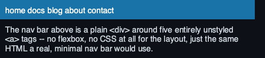

Rendering `https://suckless.org/` in `browse2.py` next to Chrome (a direct
screenshot comparison) surfaced two real, fixable gaps:

- **`ua_style.py` was missing `display: block`** for the standard
  block-level tags. It seemed unnecessary in phase 8 — `style_bridge`
  already forces block *layout* regardless — but that missed a second use:
  domonic gives *every* tag the same raw `inline` default with no UA
  stylesheet of its own (wrinkle #11), so nothing could tell an unstyled
  `<div>` apart from an unstyled `<a>` by computed style alone. Fixed, and
  needed for the next fix to work at all.
- **A run of plain `<a>` tags now approximates real inline flow**
  (`tree.py`'s `_approximate_inline_flow`). suckless.org's own nav is
  nothing but `<div><a>home</a><a>dwm</a>...</div>` — no flexbox, no CSS
  for the layout, because that's just how ordinary CSS inline flow works.
  Taffy has no inline flow at all, so it rendered as one link per line. A
  block container whose children are *mostly* (60%+) inline-tagged
  elements still computed as inline is now treated as a wrapping flex row
  instead — good enough for the very common "row of links/badges/tags"
  case, not real inline layout. Two real mistakes surfaced building this
  (see "Phase 11" in [`PLAN.md`](PLAN.md) for both): trusting computed
  `inline` alone broke ordinary paragraphs (fixed by gating on tag name
  first), and requiring *every* child to qualify let one stray `<span
  style="display:block">` among suckless.org's nine nav items veto the
  whole row (loosened to a majority).

Verified against the real page: the nav now reads "home dwm st core surf
tools libs e.V. download source" on one spaced row, instead of stacked with
no gaps between words — a close visual match to Chrome. **Not** attempted:
real inline text flow (mixed text and elements reflowing together) or CSS
floats — suckless.org's own two-column sidebar layout relies on floats,
which this POC still can't do at all; a separate, much larger project, in
the same league as a real inline-layout engine.

## Phase 12 — a real `position:absolute` bug, `<select>`, and floats

```bash
.venv/bin/python chromonic/examples/containing_block_and_select_demo.py
# -> examples/containing_block_and_select.png
```

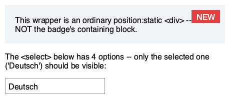

`https://www.wikipedia.org/`, next to Chrome, looked far worse than
suckless.org had — large blocks of text visibly overlapping. Three
different real causes:

- **A real `position:absolute` bug, chromonic's own.** `tree.py` made an
  absolutely-positioned element a Taffy child of its *literal DOM parent*
  and let Taffy resolve `top`/`left` against that — correct only when the
  parent actually is the CSS containing block. Real CSS resolves against
  the *nearest ancestor with `position != static`*, or the page itself —
  and Wikipedia's search box has no positioned ancestor at all, so it
  rendered relative to the wrong box entirely. Fixed with a proper
  containing-block search (`build()`'s `is_containing_block`/`escapees`) —
  verified with three cases: a direct positioned parent (unchanged), no
  positioned ancestor anywhere (now resolves against the root), and a
  positioned ancestor two levels up, preferred over both alternatives.
- **`<select>` was rendering all 250+ `<option>`s as real, visible, stacked
  boxes** — the "wall of grey language names" overlapping everything below
  it. A real `<select>` is a *closed* dropdown, showing only its current
  value. Fixed by treating it as childless for layout (same shape ``
  already has) and showing its selected option's text — with a matching
  fix needed in `paint.py` too, which walks the DOM independently and had
  no way to know `tree.py` had special-cased it.
- **A float-flow approximation**, extending phase 11's inline-flow one —
  `float: left`/`right` needs no tag gate the way inline elements do
  (its CSS initial value is always `none`, so any other value is
  unambiguous author intent). **Honest limit**: this doesn't fix a float
  *grid* — Wikipedia's featured-languages boxes pair `float: left` with
  `width: 100%` (correct for real floats, but claims the whole row once
  reinterpreted as a flex item), so they still stack one per line instead
  of wrapping into Chrome's 2-column grid. Real, meaningful improvement
  regardless: a clean stacked list instead of overlapping garbage text.

See "Phase 12" in [`PLAN.md`](PLAN.md) for the full detail, including the
minimal reproduction for the `position:absolute` bug.
